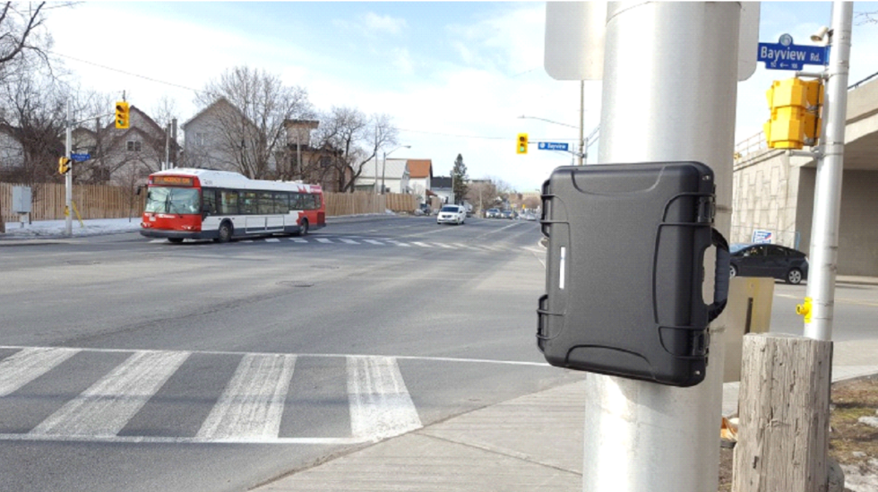

TrafficBox™ peut être installé pour collecter des données en bordure de route lorsqu'il est fixé à un poteau à l'aide de supports de montage et de pinces. L'image ci-dessous illustre la configuration de TrafficBox™ sur le terrain. La hauteur de montage recommandée du capteur est de trois mètres (10 pieds) au-dessus du sol, orientée vers la circulation routière.

