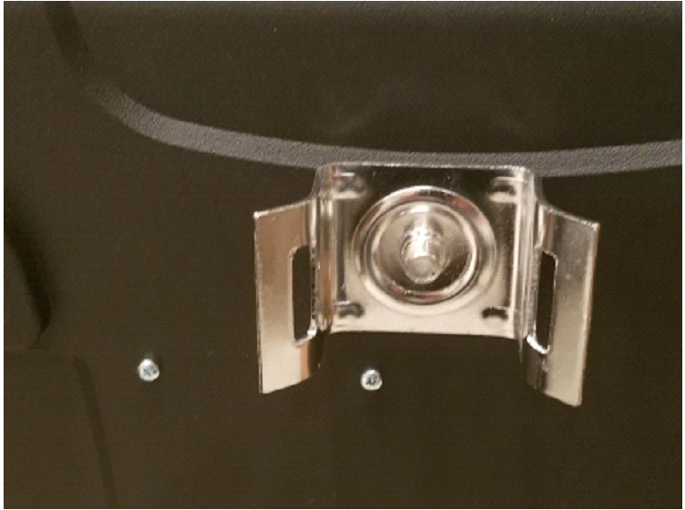

#### Table of Contents

- [Processing Unit](#processing-unit)
- [5V USB Power in Connector](#5v-usb-power-in-connector)
- [Power and LEDs Switch](#power-and-leds-switch)
- [LEDs](#leds)
- [GPS Antenna Connection](#gps-antenna-connection)
- [Temperature and Humidity Sensor](#temperature-and-humidity-sensor)
- [Scanners](#scanners)
- [Battery Pack](#battery-pack)
- [Mounting Brackets](#mounting-brackets)
- [TrafficBox Battery Installation](#trafficbox-battery-installation)

### Processing Unit

The processing unit is the main component of the whole system and is responsible for the following tasks:

- Wi-Fi and Bluetooth scanning
- Data storage
- Sensor status monitoring
- LED control
- Communication via Wi-Fi, Ethernet, or GSM Module.

#### 5V USB Power in Connector

The unit gets connected to the battery via the Mini USB connector using the provided short USB power cable.

**WARNING:** Always disconnect the USB power cable from the unit when the sensor is not in use.

#### Power and LEDs Switch

The power switch powers the sensor ON and OFF. After power ON, the unit boots up, and the scanners, GPS processes, and all the components start. At this point, the sensor is functional.

The LEDS switch turns on the status LEDs. This switch should be turned off during data collection to increase battery life or can alternatively be used to reset the LED status in "range test" mode.

#### LEDs

The TrafficBox™ unit has seven LEDs to show the status of the sensor's power supply, internet connection, GPS, and the scanners. Table 1 represents the description of each LED and its status definition.

#### GPS Antenna Connection

The GPS antenna is connected to the GPS Module to locate the position of the sensor as well as synchronize the sensor's clock to the global time servers.

**Important:** The sensor does not store the detected MAC addresses on the SD card if the sensor's clock is not synced.

#### Temperature and Humidity Sensor

The sensor temperature and humidity can be monitored and logged in the device internal memory.

#### Scanners

TrafficBox™ is capable of detecting Bluetooth Classic Discovery Mode, Bluetooth Classic Paired Mode, Bluetooth Low-Energy (LE) Discovery Mode, and Wi-Fi signals. The following table presents the recommended combination of two scanners that can be used together with minimal radio frequency signal interference.

The antennas have "male" and "female" connector polarities, so always make sure the correct antenna is used, i.e. the polarity of the antenna is the opposite of that of the scanner.

#### Battery Pack

The battery pack is the main power source of the sensor and the processing unit. Charge the battery overnight for the day of data collection. Use the provided charger and charging cable to charge the battery pack.

**WARNING – Charge the battery pack at room temperature.**

#### Mounting Brackets

Two pole-mounting brackets are used to mount the sensor to a pole. The images below show how mounting brackets should be attached to the sensor case.

**Important:** Make sure the bolts are tight, and the plastic washer is used to avoid getting moist or water into the sensor.

#### TrafficBox Battery Installation

The orange (Positive) and blue (Negative) wires from the TrafficBox board must be connected to the battery's Positive and Negative screw terminals. The battery should be tightly secured using the horizontal and vertical hook and loop straps as shown below:

**Warning!**
- The wrong polarity battery connection will damage the board and can cause a fire.
- Do not short-circuit the battery.

**Charging**
- Put the charger in 5A and LiFePO4 mode before connecting to the battery.

- Put the sensor's main power switch in the OFF position before connecting the charger to the battery.

**Warning!**
- Charge the battery at room temperature.

### TrafficBox Installation
